|Content|
|-------|
|[DC CIRCUITS](#dc-circuits)|
|[AC CIRCUITS](#ac-circuits)|
|[MAGNETIC CIRCUITS](#magnetic-circuits)|

# DC CIRCUITS

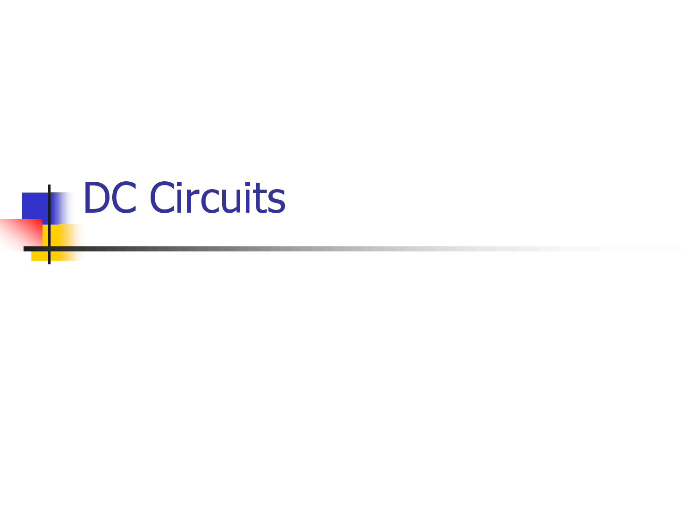

## **1. Circuit Elements and Connected Terminology**

#### **1.1 Passive Elements**

- **Resistor (R)**: Resists the flow of electric current, converting electrical energy into heat.
  - **Ohm’s Law**: $$ V = IR $$
  - **Power Dissipation in Resistor**: $4 P = I^2R = \frac{V^2}{R} $$
  - **Unit**: Ohm $$(\Omega)$$

- **Capacitor (C)**: Stores energy in an electric field when connected to a power source. Capacitance $$C$$ is measured in farads (F).
  - **Formula for Stored Energy**: $$ E = \frac{1}{2}CV^2 $$
  - **Capacitive Reactance**: $$ X_C = \frac{1}{\omega C} = \frac{1}{2 \pi f C} $$

- **Inductor (L)**: Stores energy in a magnetic field when current flows through it. Inductance $$L$$ is measured in henries (H).
  - **Formula for Stored Energy**: $$ E = \frac{1}{2}LI^2 $$
  - **Inductive Reactance**: $$ X_L = \omega L = 2 \pi f L $$

#### **1.2 Active Elements**

- **Voltage Source**: Provides a constant or variable voltage in a circuit. Can be DC (direct current) or AC (alternating current).
  - **Ideal Voltage Source**: Maintains constant voltage regardless of current.
  - **Non-Ideal Source**: Has internal resistance, which affects output voltage.

- **Current Source**: Provides a constant current in a circuit, regardless of the voltage across it.

## **2. Kirchhoff’s Laws**

#### **2.1 Kirchhoff’s Current Law (KCL)**

- **Statement**: The sum of currents entering a node (or junction) is equal to the sum of currents leaving that node.
- **Formula**: $$ \sum I_{\text{in}} = \sum I_{\text{out}} $$ or $$ \sum I = 0 $$.
  
- **Illustration**: In a node with three currents $$I_1$$, $$I_2$$, and $$I_3$$, where $$I_1$$ and $$I_2$$ enter and $$I_3$$ exits:
  - $$ I_1 + I_2 = I_3 $$

#### **2.2 Kirchhoff’s Voltage Law (KVL)**

- **Statement**: The sum of all voltages around a closed loop is zero.
- **Formula**: $$ \sum V = 0 $$.

- **Application**: In a loop with resistors $$R_1$$, $$R_2$$, and voltage source $$V$$:
  - $$ V - I R_1 - I R_2 = 0 $$
  - Solve for current $$(I)$$: $$ I = \frac{V}{R_1 + R_2} $$

## **3. Method of Solving Circuits Using Kirchhoff’s Laws**

1. **Assign Current Directions**: Arbitrarily assign a direction for each branch current (the actual direction will be determined after solving).
2. **Apply KCL at Nodes**: Write current equations for nodes.
3. **Apply KVL in Loops**: Write voltage equations for each closed loop.
4. **Solve Equations**: Use algebraic or matrix methods to solve the system of equations for unknown currents and voltages.

## **4. Star-Delta Conversion**

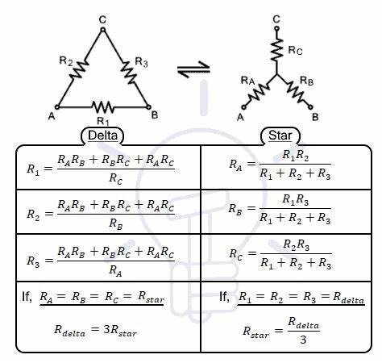

#### **4.1 Star (Y) to Delta (Δ) Conversion**

- Used to simplify networks that cannot be reduced by series-parallel combinations.

  **Formulas**:

  - $$ R_{AB} = \frac{R_1 R_2 + R_2 R_3 + R_3 R_1}{R_1} $$
  - $$ R_{BC} = \frac{R_1 R_2 + R_2 R_3 + R_3 R_1}{R_2} $$
  - $$ R_{CA} = \frac{R_1 R_2 + R_2 R_3 + R_3 R_1}{R_3} $$

#### **4.2 Delta (Δ) to Star (Y) Conversion**

  **Formulas**:
  
  - $$ R_1 = \frac{R_{AB} R_{CA}}{R_{AB} + R_{BC} + R_{CA}} $$
  - $$ R_2 = \frac{R_{AB} R_{BC}}{R_{AB} + R_{BC} + R_{CA}} $$
  - $$ R_3 = \frac{R_{BC} R_{CA}}{R_{AB} + R_{BC} + R_{CA}} $$

## **5. Ohm’s Law**

#### **Statement**

- **Definition**: The current $$I$$ through a conductor between two points is directly proportional to the voltage $$V$$ across the points, with resistance $$R$$ as a constant.
- **Formula**: $$ V = I \times R $$

#### **Power in Resistive Circuits**:

- $$ P = V \times I = I^2 R = \frac{V^2}{R} $$

#### **Limitations of Ohm’s Law**

- Only valid for **linear** (ohmic) conductors where current is directly proportional to voltage.
- Resistance in some materials (e.g., semiconductors) may vary with temperature, so Ohm’s law does not apply to non-linear devices like diodes.

## **6. Units: Work, Power, and Energy**

#### **6.1 Work (W)**

- **Definition**: Work in an electric circuit is the energy transferred by an electric charge moving under the influence of voltage.
- **Formula**: $$ W = V \times I \times t $$
- **Unit**: Joules $$(J)$$.

#### **6.2 Power (P)**

- **Definition**: Power is the rate of energy consumption or the rate at which work is done in a circuit.
- **Formula**:
  - Electrical Power: $$ P = V \times I $$
  - Alternative formulas using Ohm’s law: $$ P = I^2 R = \frac{V^2}{R}$$
- **Unit**: Watts $$(W)$$.

#### **6.3 Energy (E)**

- **Definition**: Energy is the capacity to do work.
- **Formula**: $$ E = P \times t $$
- **Unit**: Joules (J) or Watt-seconds (Ws) in electrical energy contexts.

**Types of Energy in Electrical Engineering**:

- **Electrical Energy**: Energy used by electrical devices, $$ E = P \times t $$
- **Thermal Energy**: Heat energy produced, often in resistive elements.
- **Mechanical Energy**: Energy associated with moving parts or rotating machinery (e.g., motors).

---
<!--DC ENDS-->

<!--AC STARTS-->

# AC CIRCUITS

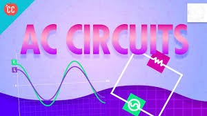

## **1. Principle of AC Voltage Waveforms and Basic Definitions**

#### **1.1 Alternating Current (AC)**

- **AC Definition**: Alternating current (AC) is a type of electrical current in which the flow of electric charge periodically reverses direction. Unlike direct current (DC), where the current flows in only one direction, in AC, the magnitude and direction of current change with time.
- **Waveform**: The waveform of AC is typically sinusoidal. The general equation for a sinusoidal AC voltage or current is given by:
  
  $$v(t) = V_{\text{max}} \sin(\omega t + \phi)$$
  
  where:

  - $$ v(t) $$ is the instantaneous voltage at time $$ t $$,
  - $$ V_{\text{max}} $$ is the peak voltage (also called **amplitude**),
  - $$ \omega = 2\pi f $$ is the angular frequency, where $$f$$ is the frequency in Hz,
  - $$ \phi $$ is the phase angle in radians.

#### **1.2 Frequency and Time Period**

- **Frequency** ($$ f $$): The number of complete cycles of the AC waveform that occur in one second. The unit is **hertz (Hz)**.

  $$
  f = \frac{1}{T}
  $$
  
  where $$ T $$ is the time period (the time taken to complete one full cycle).

- **Time Period** ($$ T $$): The duration of one cycle of the waveform, given by:

  $$
  T = \frac{1}{f}
  $$

## **2. Peak, RMS, and Average Values of Alternating Current**

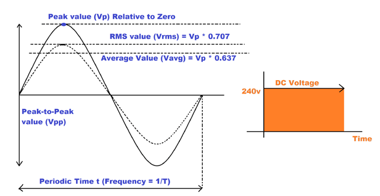

#### **2.1 Peak Value ( $$V_{\text{peak}}$$ or $$I_{\text{peak}}$$ )**

- The **peak value** is the maximum absolute value of the AC waveform (either positive or negative).
- In a sinusoidal waveform, the peak value is the highest value attained by the signal. For example, if a voltage waveform reaches 10 V at its highest point, $$ V_{\text{peak}} = 10V $$.

#### **2.2 RMS (Root Mean Square) Value**

- The **RMS value** is the equivalent DC value that would produce the same power dissipation in a resistive load as the AC current.
- For a sinusoidal waveform:

  $$
  V_{\text{RMS}} = \frac{V_{\text{peak}}}{\sqrt{2}} \quad \text{and} \quad I_{\text{RMS}} = \frac{I_{\text{peak}}}{\sqrt{2}}
  $$

  - **Formula for RMS of sinusoidal current**: 

    $$
    I_{\text{RMS}} = \frac{I_{\text{peak}}}{\sqrt{2}}
    $$

  - **RMS voltage**: If $$ V_{\text{peak}} = 10 \text{ V} $$, then $$ V_{\text{RMS}} = \frac{10}{\sqrt{2}} \approx 7.07 \text{ V} $$.

#### **2.3 Average Value**

- The **average value** is the arithmetic mean of all the instantaneous values of a waveform over a complete cycle. 
- For a sinusoidal waveform, the average value of the positive half-cycle is:

  $$
  V_{\text{avg}} = \frac{2}{\pi} V_{\text{peak}} \approx 0.637 V_{\text{peak}}
  $$

   - For a sine wave, the average value for one complete cycle (which is zero due to symmetry) is considered for the positive half-cycle.

## **3. Phasor Representation of Alternating Quantities**

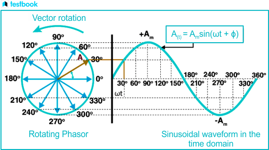

#### **3.1 Phasor Concept**

- A **phasor** is a complex number that represents a sinusoidal waveform in the form of a rotating vector in the complex plane.
- The phasor notation simplifies the analysis of AC circuits by representing the magnitude and phase of voltages and currents.
- **Phasor Form**: A sinusoidal voltage or current can be written as:

  $$
  v(t) = V_{\text{peak}} \sin(\omega t + \phi) \quad \text{is represented by the phasor} \quad V = V_{\text{peak}} \angle \phi
  $$

  where $$ \angle \phi $$ is the phase angle.

#### **3.2 Phasor Notation**

- Phasor notation expresses sinusoidal quantities as a vector with magnitude and phase. The **magnitude** is the peak value, and the **angle** (phase angle) represents the phase shift relative to a reference waveform.
  - For a voltage: $$ V = V_{\text{peak}} \angle \phi $$.
  - For a current: $$ I = I_{\text{peak}} \angle \theta $$.

## **4. Ohm’s Law in AC Circuits**

#### **4.1 Ohm’s Law for AC Circuits**

- Ohm's law in AC circuits states that the **voltage** across a component is equal to the **current** through it times the **impedance** of the component.

  $$
  V = I \times Z
  $$

  where:

  - $$ V $$ is the voltage across the component,
  - $$ I $$ is the current flowing through the component,
  - $$ Z $$ is the impedance of the component.

#### **4.2 Impedance ($$Z$$)**

- Impedance is the AC equivalent of resistance and represents the opposition to current in an AC circuit. It is a complex quantity and includes both **resistance** and **reactance** (due to inductance and capacitance).

  $$
  Z = R + jX
  $$

  where:

  - $$R$$ is the **resistance** (real part),
  - $$X$$ is the **reactance** (imaginary part).

  **Reactance**:
  
  - **Inductive Reactance**: $$ X_L = \omega L $$ (where $$ L $$ is inductance and $$ \omega = 2 \pi f $$ is angular frequency).
  - **Capacitive Reactance**: $$ X_C = \frac{1}{\omega C} $$ (where $$ C $$ is capacitance).

  **Total Impedance for Series and Parallel Circuits**:
  - **Series**: For series circuits, the total impedance is the sum of individual impedances:

    $$
    Z_{\text{total}} = Z_R + Z_L + Z_C
    $$

  - **Parallel**: For parallel circuits, the total impedance is the reciprocal sum of the individual impedances:

    $$
    \frac{1}{Z_{\text{total}}} = \frac{1}{Z_R} + \frac{1}{Z_L} + \frac{1}{Z_C}
    $$

## **5. Resistor, Inductor, and Capacitor Circuits in AC**

#### **5.1 Purely Resistive AC Circuits**

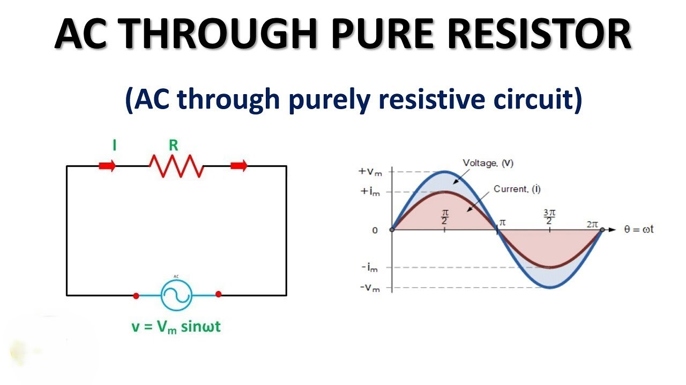

- In purely resistive circuits, the impedance is simply the resistance $$ R $$, and the voltage and current are **in phase** (i.e., no phase difference).
  - **Impedance**: $$ Z = R $$
  - **Current and Voltage Relation**: $$ V = I \times R $$

#### **5.2 Purely Inductive AC Circuits**

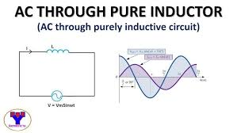

- **Inductive Reactance**: The impedance of an inductor is given by:

  $$
  Z_L = j \omega L
  $$

- In an **inductive circuit**, the current **lags** the voltage by $$ 90^\circ $$ (or $$ \frac{\pi}{2} $$ radians).
- **Phase Relation**: $$ \theta = -90^\circ $$

#### **5.3 Purely Capacitive AC Circuits**

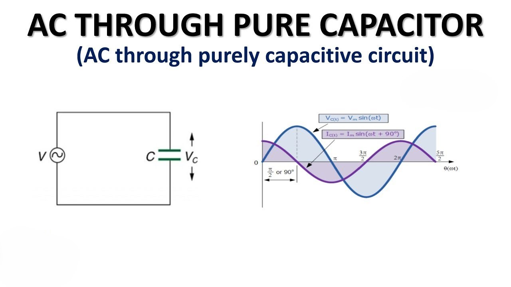

- **Capacitive Reactance**: The impedance of a capacitor is given by:

  $$
  Z_C = \frac{1}{j \omega C}
  $$

- In a **capacitive circuit**, the current **leads** the voltage by $$ 90^\circ $$.
- **Phase Relation**: $$ \theta = 90^\circ $$

## **6. Concept of Resonance in Series and Parallel Circuits**

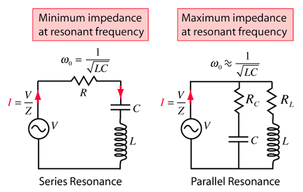

#### **6.1 Series Resonance**

- **Resonance Condition**: In a series RLC circuit, resonance occurs when the inductive reactance and capacitive reactance are equal in magnitude but opposite in phase.
  - Resonance frequency:

    $$
    \omega_0 = \frac{1}{\sqrt{LC}}
    $$

- At resonance, the impedance of the circuit is purely resistive (minimum impedance), and the current is maximum.
- **Impedance at Resonance**: $$ Z_{\text{resonance}} = R $$

#### **6.2 Parallel Resonance**

- **Resonance Condition**: In a parallel RLC circuit, resonance occurs when the total reactance (inductive and capacitive) is zero, and the circuit behaves like a purely resistive load.
  - Resonance frequency:

    $$
    \omega_0 = \frac{1}{\sqrt{LC}}
    $$

- At resonance, the impedance of the circuit is at its maximum value.

## **7. Analysis of Balanced Three-Phase Systems with Star-Delta Connections**

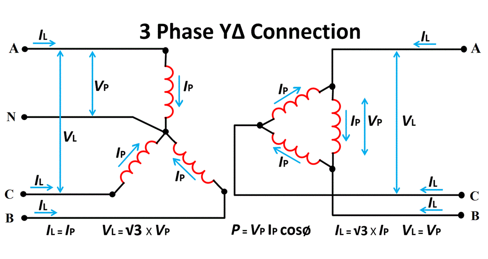

#### **7.1 Three-Phase System**

- A **balanced three-phase system** consists of three sinusoidal voltages or currents of the same magnitude and frequency, but each phase is separated by a 120° phase shift.

#### **7.2 Star (Y) Connection**

- In a **star connection**:
  - **Phase Voltage**: $$ V_{\text{phase}} = \frac{V_{\text{line}}}{\sqrt{3}} $$
  - **Phase Current**: $$ I_{\text{phase}} = I_{\text{line}} $$
  - The voltage between any phase and neutral is known as the phase voltage.

#### **7.3 Delta (Δ) Connection**

- In a **delta connection**:
  - **Line Voltage**: $$ V_{\text{line}} = V_{\text{phase}} $$
  - **Line Current**: $$ I_{\text{line}} = \sqrt{3} I_{\text{phase}} $$
  - The voltage between any two lines is known as the line voltage.

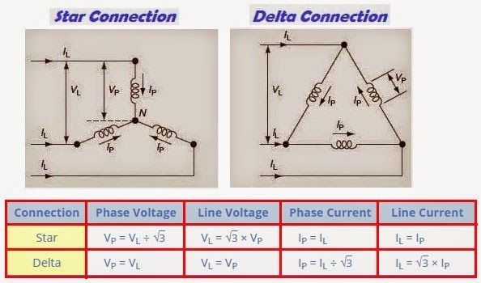

<!--AC ENDS-->

# Magnetic circuits

## **1. Comparison between Magnetic and Electric Circuits**

Magnetic circuits are similar to electric circuits in that they have analogies with current, voltage, and resistance. However, they differ fundamentally in the way magnetic fields and electric currents behave.

| **Feature**|**Magnetic Circuit**| **Electric Circuit**|
|------------|--------------------|---------------------|
| **Driving Force**| Magnetomotive Force (MMF), $$ \text{MMF} = NI $$ (ampere-turns)| Electromotive Force (EMF), $$ V = IR $$ (volts) |
| **Flow Quantity**| Magnetic Flux ($$ \Phi $$), measured in Weber (Wb)| Electric Current ($$ I $$), measured in Amperes (A)  |
| **Opposition**   | Reluctance ($$ S = \frac{l}{\mu A} $$), where $$ \mu $$ is the permeability| Resistance ($$ R = \frac{\rho l}{A} $$), where $$ \rho $$ is resistivity |
| **Magnetic Material Dependency** | Depends on the material's permeability ($$ \mu $$)| Depends on the material's resistivity ($$ \rho $$) |
| **Energy Losses**           | Hysteresis and eddy current losses due to alternating flux | Heat loss due to resistance ($$ I^2 R $$ loss) |
| **Units of Flux**           | Weber (Wb) | Coulomb (C)  |
| **Flux Density**            | Tesla (T), $$ B = \frac{\Phi}{A} $$ (where $$ A $$ is area)| A/m² (current density)  |

## **2. Magnetic Effects of Electric Current**

- **Overview**: When electric current flows through a conductor, it creates a magnetic field around it. This effect is the basis of electromagnetism and has numerous applications in electrical engineering.

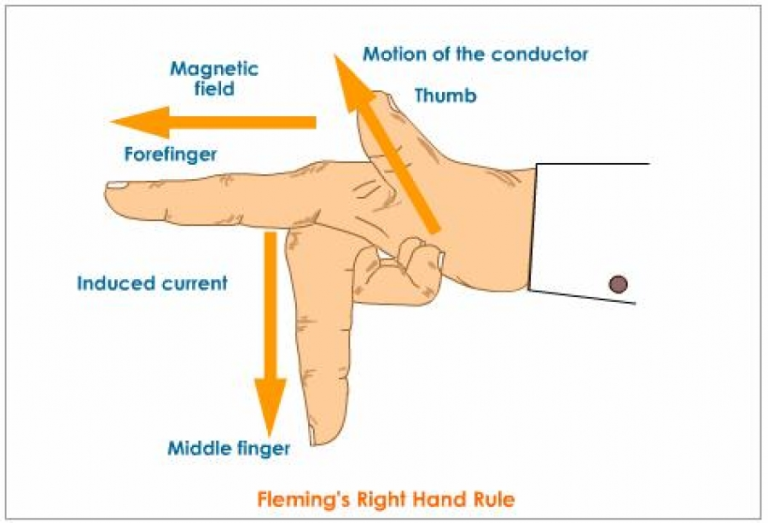

- **Right-Hand Rule**: To determine the direction of the magnetic field around a current-carrying conductor, point your thumb in the direction of the current, and your curled fingers will indicate the direction of the magnetic field lines.

### **Magnetic Field Strength (H)**

- The magnetic field strength $$ H $$ at a distance $$ r $$ from a long straight conductor carrying a current $$ I $$ is given by:

  $$
  H = \frac{I}{2\pi r}
  $$

  where:

  - $$ H $$ is the magnetic field strength in ampere-turns per meter (A/m),
  - $$ I $$ is the current in amperes (A),
  - $$ r $$ is the radial distance from the conductor in meters.

### **Magnetic Flux (Φ)**

- Magnetic flux represents the total magnetic field passing through a surface:

  $$
  \Phi = B \cdot A
  $$

  where:

  - $$ B $$ is the magnetic flux density (in Tesla),
  - $$ A $$ is the area through which the field lines pass (in m²).

## **3. Current-Carrying Conductor in a Magnetic Field**

When a current-carrying conductor is placed in an external magnetic field, it experiences a force, which is the basis of many electromagnetic devices.

### **Force on a Current-Carrying Conductor**

- The force $$ F $$ experienced by a conductor of length $$ L $$ carrying current $$ I $$ in a magnetic field $$ B $$ at an angle $$ \theta $$ is given by:

  $$
  F = B \cdot I \cdot L \cdot \sin \theta
  $$

  where:

  - $$ B $$ is the magnetic flux density (in Tesla),
  - $$ I $$ is the current (in Amperes),
  - $$ L $$ is the length of the conductor in the field (in meters),
  - $$ \theta $$ is the angle between $$ I $$ and $$ B $$.

### **Fleming's Left-Hand Rule**

- Used to determine the direction of the force: 
  - **Thumb**: direction of force,
  - **Index finger**: direction of the magnetic field ($$ B $$),
  - **Middle finger**: direction of current ($$ I $$).

## **4. Law of Electromagnetic Induction**

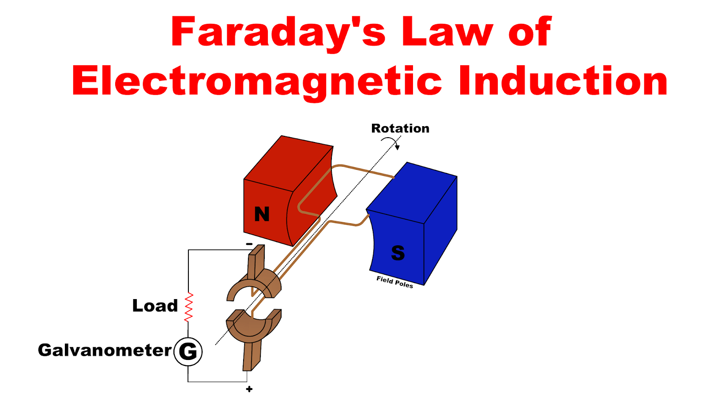

The laws of electromagnetic induction describe how voltage is generated in a conductor moving in a magnetic field or when the magnetic flux through a conductor changes.

### **Faraday's Law of Electromagnetic Induction**

1. **First Law**: An EMF is induced in a conductor when the magnetic flux linking the conductor changes.
2. **Second Law**: The induced EMF is directly proportional to the rate of change of magnetic flux:

   $$
   \text{EMF} = -N \frac{d\Phi}{dt}
   $$

   where:

   - $$ N $$ is the number of turns of the coil,
   - $$ \Phi $$ is the magnetic flux.

### **Lenz's Law**

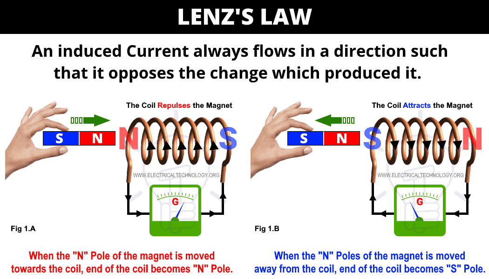

- The direction of induced EMF is such that it opposes the change in magnetic flux that produced it. This is reflected in the negative sign in Faraday's law.

## **5. Self-Inductance**

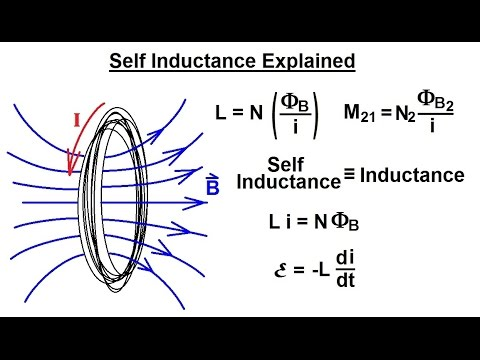

### **Definition**

- Self-inductance is the property of a coil to oppose any change in current flowing through it by inducing an EMF within itself.

### **Formula for Self-Inductance**

- For a coil with $$ N $$ turns, self-inductance $$ L $$ is given by:

  $$
  L = \frac{N \Phi}{I}
  $$

  where:

  - $$ \Phi $$ is the magnetic flux linked per turn (in Weber),
  - $$ I $$ is the current (in Amperes).

### **Energy Stored in an Inductor**

- The energy ($$ W $$) stored in an inductor due to its self-inductance $$ L $$ is given by:

  $$
  W = \frac{1}{2} L I^2
  $$

## **6. Mutual Inductance**

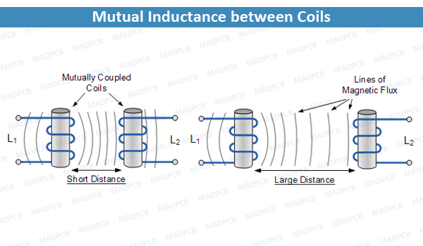

### **Definition**

- Mutual inductance is the property by which a coil induces an EMF in a neighboring coil when there is a change in current in the first coil.

### **Formula for Mutual Inductance**

- For two coils, mutual inductance $$ M $$ is given by:

  $$
  M = \frac{N_2 \Phi_{21}}{I_1}
  $$

  where:

  - $$ N_2 $$ is the number of turns in the second coil,
  - $$ \Phi_{21} $$ is the magnetic flux in the second coil due to the current $$ I_1 $$ in the first coil.

## **7. Coupling Coefficient (k)**

### **Definition**

- The coupling coefficient, $$ k $$, indicates the degree of magnetic coupling between two coils. It ranges from 0 (no coupling) to 1 (perfect coupling).

### **Formula**

$$
k = \frac{M}{\sqrt{L_1 \cdot L_2}}
$$

where:

- $$ L_1 $$ and $$ L_2 $$ are the self-inductances of the two coils,
- $$ M $$ is the mutual inductance.

## **8. Electrical Machines: Construction, Working Principle, Classification, and Applications**

Electrical machines are devices that convert energy from electrical to mechanical form or vice versa. Common types of electrical machines include transformers, DC machines, induction motors, and synchronous machines.

---

### **8.1 Single-Phase Transformer**

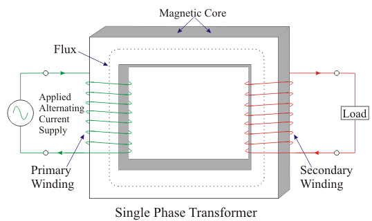

#### **Construction**

A single-phase transformer consists of two windings, primary and secondary, wound on a magnetic core:

1. **Core**: Made of laminated silicon steel to reduce eddy current losses. The core has two types of construction:
   - **Core-type Transformer**: The windings are around two limbs of the core.
   - **Shell-type Transformer**: The core surrounds the windings.
2. **Windings**:
   - **Primary Winding**: Connected to the input AC supply, generating magnetic flux.
   - **Secondary Winding**: Connected to the load and receives induced EMF.
3. **Insulation and Tank**: Insulation is provided between windings and core to prevent short circuits. The whole assembly is placed in a tank filled with oil for cooling and insulation.

#### **Working Principle**

The transformer operates on the principle of **mutual induction**. When an AC voltage is applied to the primary winding, it creates an alternating magnetic flux in the core, which links to the secondary winding, inducing a voltage according to Faraday's law.

The induced EMF in each winding is proportional to the number of turns:

$$
\frac{V_1}{V_2} = \frac{N_1}{N_2}
$$

where $$ V_1 $$ and $$ V_2 $$ are the voltages and $$ N_1 $$ and $$ N_2 $$ are the turns in the primary and secondary windings, respectively.

#### **Classification**

- **Step-Up Transformer**: Increases voltage (e.g., power stations).

- **Step-Down Transformer**: Decreases voltage (e.g., power distribution to consumers).

#### **Applications**

- Power transmission and distribution.
- Isolation transformers to prevent electric shock.
- Voltage regulation for equipment.

### **8.2 D.C. Machines (Motors and Generators)**

### **DC Motor**

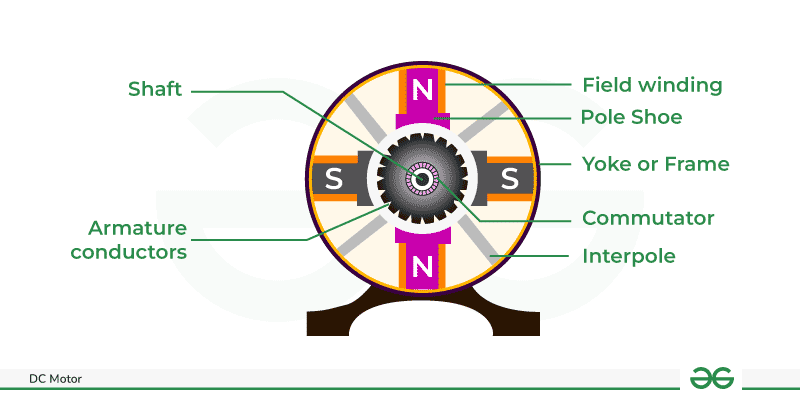

#### **Construction**

A DC motor consists of:

1. **Stator**: Stationary part that provides a magnetic field, typically consisting of field windings or permanent magnets.

2. **Rotor (Armature)**: Rotates inside the stator and has windings through which current flows.

3. **Commutator and Brushes**: Mechanical rectifier that ensures unidirectional current in the armature. Brushes maintain electrical contact with the commutator segments.

#### **Working Principle**

The DC motor works on the principle of **Lorentz force**: a current-carrying conductor in a magnetic field experiences a force. When current flows through the armature windings, it interacts with the magnetic field of the stator, producing torque that rotates the rotor.

The torque $$ T $$ generated is proportional to the armature current $$ I_a $$ and field flux $$ \Phi $$:

$$
T \propto \Phi \cdot I_a
$$

#### **Classification**

1. **Shunt Motor**: Field winding connected in parallel with the armature; provides nearly constant speed.

2. **Series Motor**: Field winding connected in series with the armature; offers high torque at low speeds.

3. **Compound Motor**: Combination of series and shunt winding, providing both high torque and better speed regulation.

#### **Applications**

- **Shunt Motor**: Lathes, centrifugal pumps, machine tools.

- **Series Motor**: Electric traction (trains), cranes, conveyors.

- **Compound Motor**: Heavy-duty applications like elevators, rolling mills.

### **DC Generator**

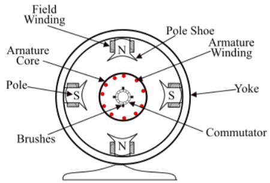

#### **Construction**

The DC generator has components similar to a DC motor:

1. **Stator (Field Winding)**: Produces the magnetic field.

2. **Rotor (Armature)**: Contains coils where EMF is induced.

3. **Commutator and Brushes**: Convert the alternating EMF produced in the 
armature into a unidirectional output.

#### **Working Principle**

A DC generator operates on **Faraday’s law of electromagnetic induction**: an EMF is induced in a conductor when it moves through a magnetic field. The rotor rotates inside the stator’s magnetic field, cutting across magnetic lines, inducing EMF in the armature coils.

The induced EMF $$ E $$ is given by:

$$
E = P \cdot N \cdot \Phi \cdot Z / 60A
$$

where $$ P $$ is the number of poles, $$ N $$ is the speed in RPM, $$ \Phi $$ is flux per pole, $$ Z $$ is the total number of conductors, and $$ A $$ is the number of parallel paths.

#### **Classification**

1. **Separately Excited Generator**: Field winding energized from an external source.
2. **Self-Excited Generator**:
   - **Shunt Generator**: Field winding connected parallel to armature.
   - **Series Generator**: Field winding connected in series.
   - **Compound Generator**: Combination of series and shunt windings.

#### **Applications**

- **Battery Charging**: Separately excited generators.
- **Power Supply**: Self-excited generators for DC loads.

### **8.3 Three-Phase Induction Motor**

.png)

### **Construction**

1. **Stator**: Stationary part with three-phase windings. When supplied with AC, these windings create a rotating magnetic field.
2. **Rotor**: There are two types:
   - **Squirrel Cage Rotor**: Conductors short-circuited with end rings, robust and low maintenance.
   - **Wound Rotor**: Contains insulated windings connected to slip rings for external resistance control.

### **Working Principle**
The motor works on the principle of **rotating magnetic field** and **induction**. When a three-phase supply is given to the stator, a rotating magnetic field is generated. This field induces current in the rotor (by mutual induction), producing a torque that causes it to rotate.

The speed $$ N $$ of the rotor is less than the synchronous speed $$ N_s $$ of the stator field due to **slip**:

$$
\text{Slip (s)} = \frac{N_s - N}{N_s}
$$

### **Classification**

1. **Squirrel Cage Induction Motor**: Simple and rugged; used where constant speed is needed.
2. **Wound Rotor Induction Motor**: Allows speed control by adding resistance to the rotor circuit.

### **Applications**

- **Squirrel Cage Motors**: Industrial machinery, fans, pumps, compressors.
- **Wound Rotor Motors**: Applications requiring high starting torque and adjustable speed.

### **8.4 Three-Phase Synchronous Machines (Motors and Generators)**

### **Synchronous Motor**

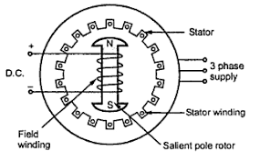

#### **Construction**

1. **Stator**: Three-phase windings in the stator create a rotating magnetic field when supplied with AC.
2. **Rotor**: Contains windings connected to a DC source. The rotor’s magnetic field locks in step with the stator’s rotating magnetic field.

#### **Working Principle**

The synchronous motor runs at synchronous speed, which is the speed of the rotating magnetic field:

$$
N_s = \frac{120 \cdot f}{P}
$$

where $$ f $$ is the frequency and $$ P $$ is the number of poles.

Since the rotor is excited with DC, it creates a constant magnetic field. The rotating magnetic field of the stator pulls the rotor into synchronous speed by magnetic locking.

#### **Applications**

- **Power Factor Correction**: Used in power systems to improve power factor.
- **Constant-Speed Drives**: Synchronous motors are ideal for applications that require constant speed, such as compressors, blowers, and centrifugal pumps.

### **Synchronous Generator**

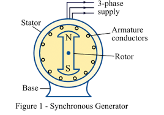

#### **Construction**

The construction is similar to synchronous motors:
1. **Stator**: Contains three-phase windings where output power is generated.
2. **Rotor**: Excited by a DC source, creating a magnetic field that cuts across the stator windings as the rotor rotates.

#### **Working Principle**

Synchronous generators work on **Faraday's law of electromagnetic induction**. When the rotor (excited by DC) rotates, the magnetic field created by the rotor poles cuts across the stator windings, inducing EMF.

The output voltage frequency is given by:

$$
f = \frac{N \cdot P}{120}
$$

where $$ N $$ is the rotor speed in RPM, and $$ P $$ is the number of poles.

#### **Applications**

- **Electric Power Generation**: Used in hydroelectric, thermal, and nuclear power plants to generate three-phase AC power.
- **Alternators in Vehicles**: Provide electrical power to vehicle electrical systems.

---
